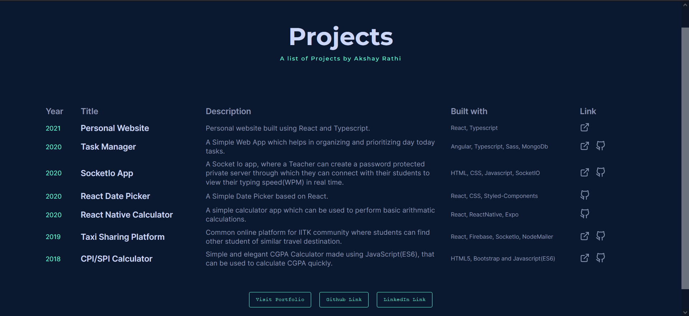

# Projects List

A list of personal projects developed by Akshay Rathi.  Design heavily inspired from <a href="https://brittanychiang.com/">Brittany Chiang.</a>'s Archive Project List 
The Project is live at <a href="https://projects.akshayrathi.com" target="_blank">link</a>

## Project Screen Shot(s)

## Project List

The project has been build using below frameworks and tools:

- [Html/CSS](https://developer.mozilla.org/en-US/)
- [Javascript](https://developer.mozilla.org/en-US/)

## Authors

Developed By [Akshay Rathi](https://akshayrathi.com)

&nbsp;&nbsp;&nbsp;&nbsp;&nbsp;&nbsp;&nbsp;&nbsp;&nbsp;&nbsp;&nbsp;&nbsp;

## Acknowledgments

Design Inspiration

- [Brittany Chiang Archive](https://brittanychiang.com/archive)
